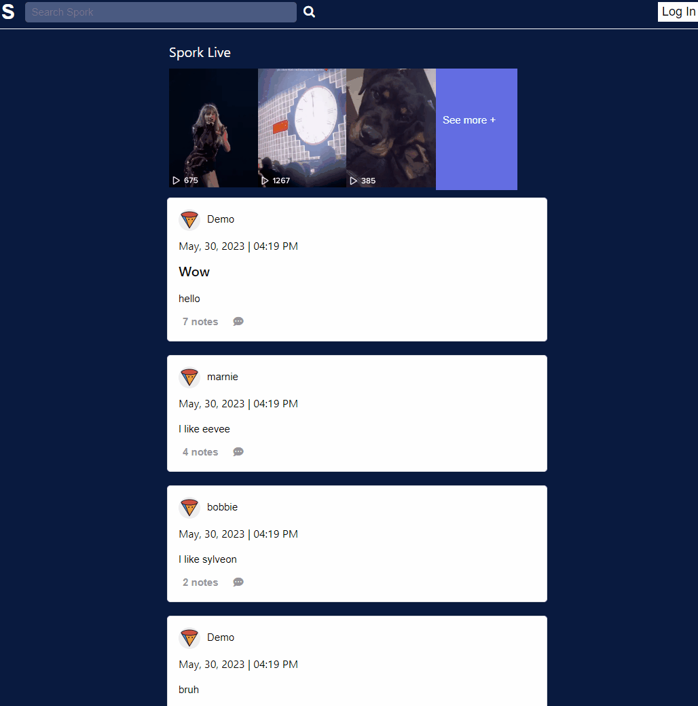

# SPORK

Welcome to SPORK, a modern web app that enables users to create posts and share them with other users via a personalized feed. With SPORK, you can share your thoughts, ideas, and experiences with the world, and connect with like-minded individuals who share your interests.

Live link -> https://spork-group-project.onrender.com/

## Technologies Used

Our team utilized the following technologies to develop SPORK:

- **Node.js**: A server-side runtime environment that enabled us to build scalable and high-performance applications.
- **React**: A JavaScript library that helped us create a dynamic and responsive user interface.
- **Redux**: A predictable state container that helped us manage complex application state across components.
- **Flask**: A micro web framework that allowed us to build the backend of our application with Python.
- **Python**: A high-level programming language that enabled us to implement complex functionality with ease.
- **SQLAlchemy**: An Object-Relational Mapping (ORM) library that provided a high-level interface for working with our PostgreSQL database.
- **PostgreSQL**: A powerful open-source relational database that provided a robust and scalable data storage solution.

## Lesson Learned

Through this project, we learned the importance of effective communication and collaboration when working on a team. We found that it was essential to establish clear goals and expectations at the outset of the project, and to maintain open lines of communication throughout the development process.

We also learned the value of leveraging existing tools and frameworks to streamline development and improve efficiency. By utilizing technologies like Node.js, React, and SQLAlchemy, we were able to build a robust and scalable application in a relatively short amount of time.

Overall, this project was a valuable learning experience, and we look forward to applying the skills and knowledge we gained to future projects.

## Meet the Engineers

Our team consisted of the following engineers:

- Michael Tuazon ([GitHub](https://github.com/Miketuazon) | [LinkedIn](https://www.linkedin.com/in/miketuazon/))
- Brian Washington ([GitHub](https://github.com/zipzopboppitybop) | [LinkedIn](https://www.linkedin.com/in/brian-washington-668129244/))
- Derrick Truong ([GitHub](https://github.com/Derrick-Truong) | [LinkedIn](https://www.linkedin.com/in/derrick-truong-1a092121a/))
- Kisha Onia ([GitHub](https://github.com/kishaonia) | [LinkedIn](https://www.linkedin.com/in/kisha-rose-onia-63bb35182/))

## Features
This web application was designed and developed within a two-week time.  Below are all the main features I was able to implement.

## **Log In / Sign Up**
- Secure User Authorization using Werkzeug Security hashing
- User Log In / Sign Up errors are shown in form
- Demo user provided for users that want to test the site

## **Posts Feed**
- Displays the posts made by users
- Users can like / unlike the posts
- Users can follow / unfollow the user that created the post

## **Create/Update Posts**
- A modal opens and allows a user to create a post
- User can also edit the post if they made a mistake
- Post will display User of post, time stamp, title, content, and notes

## **Delete a Post**
- A modal opens and allows a user to delete a post they created
- Post is removed from all pages it would be displayed on
- User can opt to cancel if they do not want to delete their post

## **Likes Page**
- Users are able to see which posts they have liked
- Users can unlike a post if they want to remove it from their likes page

## Comments
- Users are able to comment on other users' post
- Users can edit a comment if they want to change it
- Users can also delete their comment as well

## Follows

## Search Bar
